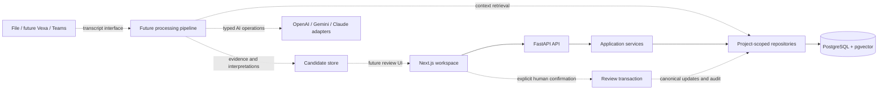

# Phase 0 implementation plan

Status: Phase 0 complete, including Steps 0.1, 0.2 and 0.3a–e. Results are
recorded in [phase-0-results.md](../testing/phase-0-results.md).

Baseline: [current-state.md](current-state.md). The repository is empty, so the
foundation can use the preferred stack without a rewrite or migration of existing
behavior. Reserve roughly the first 1–2 working days of the 10–12 day prototype
for this phase; dependencies and database availability may affect that estimate.

## Scope and acceptance criteria

Phase 0 establishes architecture, reproducible tooling, initial PostgreSQL
migrations, project-scoped data access, and one deterministic demo seed.

Phase 0 is accepted only when:

1. Architecture, data model, security boundaries, and testing decisions are documented.
2. Locked dependencies install and the technical application skeleton starts.
3. Build, lint, formatting, type checks, and foundation tests pass.
4. Migrations work against an empty database; supported rollback/reapply is verified
   in a disposable test database.
5. Seeding creates exactly one demo project and is safe to repeat.
6. Constraints reject cross-project references and invalid canonical states.
7. Repository integration tests exercise real PostgreSQL, not SQLite substitutes.
8. The foundation receives a smoke test and a phase completion report.

Workspace UI, document upload, embeddings, transcript ingestion, AI calls,
candidate processing, review flows, and task synchronization belong to later
phases. No later phase starts without its own checkpoint.

## Proposed technical decisions

| Boundary                  | Proposed choice                                                                  | Reason                                                                                 |
| ------------------------- | -------------------------------------------------------------------------------- | -------------------------------------------------------------------------------------- |
| Frontend                  | Next.js App Router, React, TypeScript, Tailwind; shadcn/ui and Lucide in Phase 1 | Matches the brief and supports a consistent SaaS workspace                             |
| Backend                   | FastAPI + Python 3.12, Pydantic                                                  | Typed APIs and straightforward later document parsing/AI contracts                     |
| Persistence               | PostgreSQL + pgvector; SQLAlchemy 2 and Alembic                                  | One relational/vector database with explicit migrations                                |
| Dependency management     | npm with committed lockfile; uv with committed lockfile                          | Simple reproducible installation with tools available here                             |
| Backend checks            | pytest, Ruff, mypy                                                               | Deterministic unit/integration checks and static validation                            |
| Frontend checks           | ESLint, TypeScript, Prettier; Playwright smoke test                              | Build and browser verification before product UI                                       |
| Runtime                   | Two application processes and one local PostgreSQL service                       | No message bus, microservice split, or dedicated vector database                       |
| Authentication            | Local development with a fixed demo actor; defer real authentication             | Keep this checkpoint achievable; do not expose the prototype publicly as authenticated |
| Optional task integration | GitHub Issues, deferred to its phase                                             | One adapter; core application remains independent                                      |

Dependency versions will be selected for compatibility and locked when the
skeleton is created. Pin the pgvector-enabled database image to a tested version
or digest then; do not rely on a floating `latest` tag.

### Architectural boundaries



Dashed boundaries are future contracts, not Phase 0 functionality. A single
FastAPI application owns the processing pipeline; no separate worker service is
required initially. Keep business rules in application/domain modules and
provider calls in adapters.

Future context retrieval will combine project-scoped structured matches with a
small number of document chunks. Source evidence, validated candidate
interpretations, and confirmed state use separate records. The future confirmation
service must validate authority and current entity version, then update state and
append an audit event in one transaction. AI detector code must not call canonical
write services.

## Intended repository layout

```text
ProjectPulse/
├── apps/
│   ├── web/                  # Next.js; technical shell and tests/e2e in Phase 0
│   └── api/
│       ├── app/
│       │   ├── api/          # thin HTTP endpoints
│       │   ├── domain/       # entity contracts and invariants
│       │   ├── services/     # application operations
│       │   ├── repositories/# project-scoped persistence
│       │   ├── db/           # session/models
│       │   └── adapters/     # future AI/transcript/integration boundaries
│       ├── migrations/
│       └── tests/
├── tests/fixtures/           # future AI evaluation fixtures
├── docs/architecture/
├── docs/testing/
├── docs/decisions/
├── compose.yaml
├── .env.example
└── README.md
```

Create directories only as they gain real files. Avoid speculative empty adapter
implementations and unused dependencies.

## Step 0.1 — Repository assessment

**Complete at this checkpoint.** See the assessment for exact baseline command
outcomes. No application tests exist yet.

## Step 0.2 — Architecture proposal

**Complete:**

- Create `docs/architecture/proposed-architecture.md` with finalized boundaries,
  diagram, API error conventions, project-context pipeline, transcript interface,
  provider interface, and confirmation rules.
- Create `docs/architecture/data-model.md` with initial entities, ownership,
  constraints, migration stages, and later evidence/candidate relationships.
- Create `docs/testing/strategy.md` with unit/integration/browser suites,
  isolated test database setup, deterministic mocks, and optional live-model evals.
- Record the stack/auth scope in `docs/decisions/ADR-001-foundation.md`.

**Acceptance/testing:** review the proposal against the brief; trace each later
MVP flow through its boundaries; confirm one backend and one database, no
browser secrets, separate candidates and canonical state, and no unnecessary
infrastructure. Check documentation links/diagram and record the review.

**Checkpoint:** report Step 0.2 complete with decisions and unresolved dependencies
before adding infrastructure.

## Step 0.3 — Database foundation, in small checkpoints

### Step 0.3a — Reproducible technical skeleton

**Implement:** create the Next.js and FastAPI manifests/lockfiles, minimal startup
files, lint/format/type settings, safe environment examples, and setup README.
Add `/health/live` to FastAPI without requiring a database. The frontend renders
only a technical foundation page, not the Phase 1 workspace.

**Acceptance/testing:** locked installs; frontend build/lint/type/format checks;
backend lint/type/format checks; an API liveness test that succeeds without a
database. Verify API secrets are absent from client configuration. Record exact
commands in `docs/testing/phase-0-results.md` before advancing.

### Step 0.3b — PostgreSQL and migration plumbing

**Implement:** add a pinned pgvector-enabled PostgreSQL Compose service bound to
localhost, SQLAlchemy sessions, Alembic configuration, and database readiness
endpoint. Enable the vector extension through an explicit migration. Do not add
embedding columns or an embedding provider until Phase 2.

**Acceptance/testing:** start a disposable database, apply the first migration,
verify the extension, exercise readiness in available/unavailable states, check
connection cleanup, and rollback/reapply where supported. Re-run skeleton checks.
Document any extension privilege requirement and failure behavior.

**Dependency:** first verify Docker daemon/image access. Read the environment's
container/network guidance before downloading or running images. If unavailable,
use an explicitly configured PostgreSQL endpoint and a separate disposable test
database; never substitute SQLite or claim database checks passed without PostgreSQL.

### Step 0.3c — Initial canonical schema and repositories

**Implement:** migrate users, projects, project memberships/stakeholder roles,
requirements, decisions, commitments, risks, milestones, dependencies,
open questions, and audit events. Use UUIDs, UTC timestamps, explicit status
constraints, project-scoped unique constraints, and composite foreign keys where
entities reference other project entities. Preserve the specified decision status
set, including `PROVISIONAL`, `REVIEW_REQUIRED`, `CONFIRMED`, and `SUPERSEDED`.

Keep baseline provenance explicit as manual/seed input. Real meetings,
utterances, documents/chunks, AI candidates, deltas, conflicts, and integrations
receive migrations in the phases that introduce them. Do not invent meeting IDs
or store a seed as if it were transcript evidence.

Implement repositories that require a project ID for project data access. Internal
data access is foundation work; user-facing CRUD APIs remain Phase 2 work.

**Acceptance/testing:** migrate an empty database; validate downgrade/reapply;
round-trip records through repositories; test status/check/foreign-key constraints;
reject cross-project references; verify another project's IDs cannot be read or
updated through scoped repositories; verify failed transactions do not leave
partial changes. Record the schema and regression results before continuing.

### Step 0.3d — Deterministic demo seed

**Implement:** add an explicit seed command for one project named
`Client Portal Modernization` (the brief's later demo scenario). Seed stakeholders
and the following human-established baseline with stable identifiers:

- SSO: Phase 2.
- Launch: 24 November 2026, stored as a date.
- Database: PostgreSQL, confirmed technical decision.
- Production credentials: pending commitment with an explicit owner; no invented due date.
- Security review: pending dependency/open question.
- CSV export: synchronous, confirmed baseline decision.
- Payment retries: three attempts, confirmed baseline decision.

**Acceptance/testing:** seed a migrated empty database; verify exact values and
project counts; repeat the seed and verify no duplicates; confirm reseeding does
not overwrite user-edited canonical state. Run seed/repository regression tests.
Document seeded values and how to recreate only a disposable demo database.

### Step 0.3e — Foundation end-to-end checkpoint

**Implement:** add a browser smoke test for the technical page and backend health
check; document setup and verification commands. Readiness checks must exercise a
real migrated PostgreSQL database. No product UI or AI behavior is implied by this
smoke test.

**Acceptance/testing:** fresh locked installation, migrations, seed, backend
startup/health, frontend build/start/browser smoke, and all established checks.
Review diffs for scope regressions; record failures separately from passes.

**Checkpoint:** publish the prescribed `PHASE 0 COMPLETE` report only if every gate
passes. Include changed files, database changes, actual unit/integration/E2E
counts, manual verification, limitations, documentation, and readiness for Phase 1.
Stop at the phase boundary before implementing the workspace.

## Risks and dependencies

- The empty repository has no working install or test baseline; setup is new work.
- Current network enforcement/readiness is unverified. Check policy and supported
  runtime status before dependency or container downloads.
- PostgreSQL utilities are absent; Docker CLI presence does not prove the daemon
  or pgvector image can run. Database testing depends on resolving that availability.
- No AI keys are configured. Phase 0 must remain fully testable without them;
  later adapters use server-side environment configuration and deterministic mocks.
- Local demo identity is not production authentication. Project-scoped queries
  provide data isolation checks but do not establish authentication security.
- Migration downgrade tests run only in disposable databases; never destroy a
  user database to satisfy a check.

## Progression rule

Each substep follows implementation → testing → documentation → regression review
→ acceptance check → completion report. Advance only after that gate passes.
Phase 0 is complete. The next proposed checkpoint is Phase 1, Step 1.1 (app shell).
No later-phase implementation has begun.
