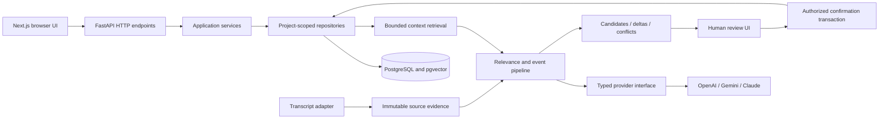

# ProjectPulse architecture

Status: Step 0.2 architecture decision, 3 October 2026. Application implementation
begins in Step 0.3a. See [the phase plan](phase-0-plan.md),
[data model](data-model.md), [testing strategy](../testing/strategy.md), and
[foundation ADR](../decisions/ADR-001-foundation.md).

## Stack and runtime

- Next.js App Router, React, TypeScript, Tailwind; shadcn/ui and Lucide in Phase 1.
- FastAPI, Pydantic, SQLAlchemy 2, psycopg, Alembic, Python 3.12.
- PostgreSQL with pgvector. One database serves relational and future semantic data.
- npm and uv lockfiles. Two application processes and one local database service.

No separate Node backend, message broker, vector service, or generic agent runtime
is needed. FastAPI owns business operations; Next.js owns presentation. Do not
duplicate project-state business rules in Next.js handlers or React components.

Only the technical shell and persistence foundation are built in Phase 0.
The processing/review boundaries describe future phases.

## Code responsibilities

| Module | Responsibility |
| --- | --- |
| `apps/web` | Views, accessible forms, loading/error/empty states; typed API client |
| `apps/api/app/api` | Validate HTTP inputs, resolve actor/project, map errors |
| `apps/api/app/domain` | Entity statuses, invariants, typed contracts |
| `apps/api/app/services` | Transactions and application use cases |
| `apps/api/app/repositories` | SQLAlchemy queries requiring explicit project scope |
| `apps/api/app/db` | Models, engine and sessions; Alembic owns schema changes |
| `apps/api/app/adapters` | Future external AI, transcript, embedding, task APIs |

Create abstractions when their phase introduces actual behavior. Avoid placeholder
adapters that imply unavailable integration support.

## HTTP boundary and configuration

Use `/api/v1/projects/{project_id}/...` for future project operations. Resolve
membership before repository access; a project ID supplied by a browser is not
authority. Return 404 for inaccessible or missing scoped entities, 422 for invalid
input, 409 for stale versions/invalid transitions, and 503 for unavailable dependencies.

Foundation endpoints are `GET /health/live` (process health without database access)
and `GET /health/ready` (bounded PostgreSQL probe plus expected migration revision).
Health responses contain status, not connection strings, credentials or exception text.
Error responses use `{"error":{"code":"...","message":"..."}}`; adapt FastAPI
validation errors to this convention when business endpoints are introduced.

Secrets belong to server environment variables. Public frontend configuration may
contain only the API base URL. Use a localhost-only CORS allowlist and development
ports. Versioned inputs use Pydantic; render evidence as text, never unsafe HTML.
The local fixed demo actor is explicitly development-only; public deployment must
add real authentication and enforce membership. Scoped queries alone are not auth.

## Canonical write rule

The initial seed and later manual edits represent human-established state.
AI processing may persist evidence and candidate interpretations but cannot call
canonical write services. Do not convert an extraction result into a confirmed
decision just because its confidence is high.

Future confirmation must, in one database transaction:

1. Resolve the human actor and verify project membership/required reviewer roles.
2. Lock the candidate and targeted canonical record; check candidate status and
   the reviewed canonical version to avoid applying stale conclusions.
3. Validate supplied edits and the allowed transition.
4. Apply the canonical change, increment its version, and retain supersession history.
5. Mark the candidate applied and append an audit event with actor and provenance.

Reject/ignore leaves canonical state unchanged. A unique applied-candidate/action
key makes repeated requests idempotent. No automatic external task writes occur.

## Transcript ingestion and future processing

Phase 3 implements `TranscriptAdapter[Source].parse(source) -> ParsedTranscript`
in `app/services/transcript_adapters.py`. The file adapter accepts structured TXT,
JSON and the documented VTT subset. It normalizes bounded utterances with speaker
labels/IDs, elapsed milliseconds, source sequence, text and optional confidence.
The scoped upload service retains immutable source bytes/hash and stable utterance
citations without writing canonical state. Unknown speakers/times remain explicit;
attribution does not establish commitment ownership. Future Vexa and Teams adapters
can implement the protocol with their own source types; neither is active now.
See [transcript ingestion](../features/transcript-ingestion.md).

Future processing phases will use bounded batches:

1. Persist immutable project-scoped evidence and a processing-run identifier.
2. Apply deterministic relevance rules, then classify ambiguous windows with context.
3. Extract typed candidate events from relevant windows.
4. Retrieve a small set of structured records and document chunks for those events.
5. Compare with canonical values/versions; persist deltas, conflicts and review needs.
6. Generate useful questions and impact counts from persisted results.

Source IDs, prompt version, provider/model and processing status travel with results.
Validate every returned evidence ID against that meeting/project. Cap input size,
context size, model calls and retries. Detector failure records a partial result and
keeps unrelated detectors usable. Reprocessing is idempotent for a run/input version.

## AI and retrieval boundary

`AIProvider` exposes application operations: `classifyProjectRelevance`,
`extractProjectEvents`, `detectProjectDelta`, `detectDecisionConflict`,
`suggestClarifyingQuestion`, and `summarizeMeetingImpact`. Each operation accepts
small typed inputs and returns a Pydantic-validated schema. Dedicated versioned
prompt modules supply narrow tasks. Provider-specific SDK calls stay in adapters.

An embedding interface is separate: embedding models/providers have different
dimensions and capabilities from generative providers. Record embedding model,
dimension and content hash; do not compare embeddings from incompatible models.
OpenAI/Gemini/Claude are planned generative adapters, not claims of Phase 0 support.

`searchProjectContext(projectId, query)` always scopes SQL before ranking. Combine
structured entity matching and vector similarity, using a bounded result limit
and provenance. Do not send full project history to a model. Document parsing,
chunks, indexes, embeddings and deletion behavior are Phase 2 work.

## Integrations and operational limits

Optional GitHub Issues integration arrives after the core pipeline. Preview an
action, obtain explicit confirmation, execute it server-side, and track the
idempotency key/external ID. The application works with no integration configured.

Timeouts, rate limits, schema failures and unavailable providers map to typed errors
and bounded retries. Log request/run IDs, counts, latency and safe error codes;
do not log keys, connection credentials or full transcripts. Record approximate
model usage once calls exist. Database transactions are short and do not hold
locks across external model calls.

## Step 0.2 acceptance review

The design supports baseline state → evidence ingestion → candidate/delta detection
→ evidence review → confirmation without giving AI canonical write access. It
also supports side-meeting provisional decisions and later conflicting evidence
without overwriting the confirmed baseline. Concrete walkthroughs and verification
are recorded in [phase-0-results.md](../testing/phase-0-results.md).
