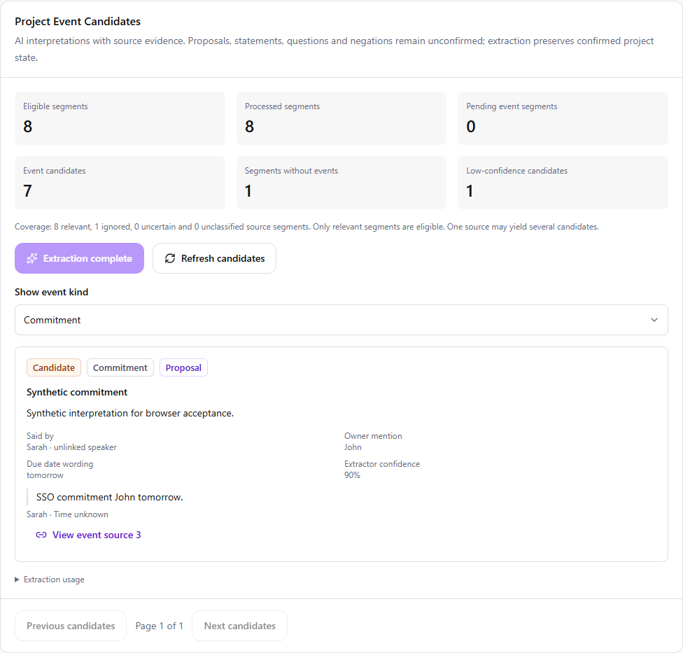
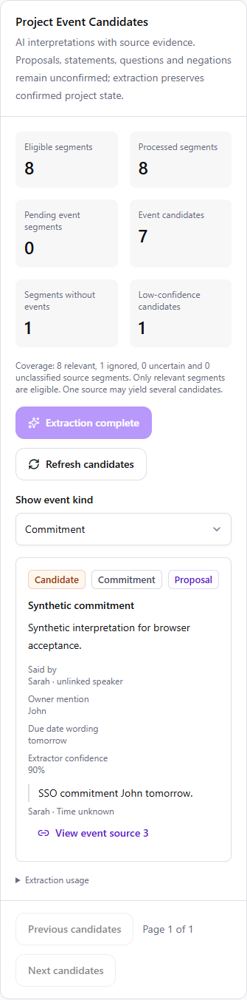

# Phase 5: project event extraction

Authorized 5 October 2026 (Asia/Calcutta). Branch:
`phase/5-project-event-extraction`, based on completed main `eabde14`.

## Checkpoints and acceptance

1. **Step 5.1 — contracts and provider.** Strict seven-kind event schemas, explicit
   proposal/statement/question/negation wording, literal owner/date mentions,
   source-window quote validation, bounded Gemini adapter and labeled fixtures.
   Test malformed/partial/foreign-source output, Unicode quotes, unknown owners,
   missing dates, budget and provider failures. No persistence/API/UI in this step.
2. **Step 5.2 — scoped persistence and API.** Add an explicit migration for extraction
   runs, completed source segments, event candidates and evidence links. Process
   only current Phase 4 RELEVANT results, one bounded batch per explicit action.
   Preserve zero-event completions, stable IDs, retry/cache/stale-baseline behavior,
   concurrent leases, project isolation, audit rollback and unchanged canonical data.
   Test real PostgreSQL migration rollback/schema comparison and injected provider
   boundaries. Missing configuration leaves pending work with an honest error.
3. **Step 5.3 — meeting UI and phase acceptance.** Add a shared-design-system candidate
   panel with prerequisites, explicit extraction/retry, pagination and filters,
   low-confidence notices, source citations, usage and honest coverage. Validate
   client payload scope/quotes, loading/error/empty states, mobile/keyboard behavior
   and canonical preservation. Run full unit/integration/browser/static/build checks,
   update the completion report, push, require green CI and merge through a PR.

Every step is tested, documented, reviewed, committed and pushed before the next
begins. Stop after the completed-phase merge; Phase 6 is not authorized.

## Contract

Candidate kinds: REQUIREMENT_CHANGE, DECISION, COMMITMENT, RISK, MILESTONE_CHANGE,
DEPENDENCY and OPEN_QUESTION. A candidate's `statement` is PROPOSAL, STATEMENT,
QUESTION or NEGATED. None of these establish canonical confirmation or authority.
Each candidate carries a short title/description, finite numeric confidence,
nullable `ownerMention` and `dueDateText`, and one or two exact source quotes.

Every event must cite its primary source. Its immediately preceding source may
also be cited when needed to interpret a response. References to another source
window or fabricated/altered quotes fail the entire batch. Owner/date wording must
occur literally, on word boundaries, in cited quotes. Unknown values remain null;
relative dates remain source wording. No user ID or calendar date is invented.
Speaker identity remains provenance, independently of any interpreted owner mention.

The provider returns exactly one result per primary source, including an empty
event list when it finds no event. Budgets: 20 windows, 20,000 source characters,
20,000 context characters, four events per source, two evidence references per
event, 500 characters per quote, 512 KiB response, 25-second request timeout and
one provider call per explicit action. There is no automatic retry or fake fallback.

`EventProvider.extract()` isolates Gemini REST calls. Reuse the server-only
`GEMINI_API_KEY`; `GEMINI_EVENT_MODEL` selects the model independently of embeddings
and relevance. Default `gemini-3.5-flash-lite` is listed in the
[official model documentation](https://ai.google.dev/gemini-api/docs/models/gemini-3.5-flash-lite).
[Schema-constrained output](https://ai.google.dev/gemini-api/docs/structured-output)
is independently validated; schema success alone does not prove semantic accuracy.

Event extraction never calls canonical write services. Delta comparison, conflict
detection, governance, approving/rejecting/applying candidates, task synchronization
and live conferencing integration belong to later phases.

## Persistence and API

Migration `0007_events` follows `0006_relevance`. `event_extractions` records context,
model/version, usage and a 45-second processing lease. `extracted_segments` marks
completed primary sources even when no event is returned. `project_event_candidates`
and `event_candidate_evidence` preserve interpretations and exact quotes independently
of canonical tables. Scoped foreign keys cascade with source meeting deletion.

GET `/api/v1/projects/{projectId}/meetings/{meetingId}/events` returns prerequisites,
current relevance identity, stale state, segment coverage, candidates and usage.
`page` is 1–400, page size is 100, and `kind` is ALL or one of the seven kinds.
POST at the same path accepts no body and processes one batch. No source transcript,
project context, owner ID, confirmation or model override is accepted from the client.
Unavailable AI records an honest error with remaining work pending. Explicit retry
keeps saved results and processes unfinished sources. Uncertain/ignored relevance
is excluded; additional current relevance results can extend the eligible set.

Counts distinguish source segments from event candidates (up to four per segment).
Below 0.65 confidence, candidates need review but remain candidates at every score.
Old runs remain readable with a stale warning after context/model changes. The API
requires current relevance before starting another extraction. Token totals count
only reported usage; attempts and recorded latency do not imply cost estimates.

## Meeting UI and acceptance

Project Event Candidates sits between Meeting Impact and transcript evidence. It
refreshes after explicit relevance analysis and exposes extraction/retry, saved-run
coverage, stale/partial context, kind filters, 100-candidate pages, exact quotes,
source links and recorded usage. Every record is labeled Candidate independently
of confidence and proposal/statement/question/negation. Owner/date values are literal
mentions, not resolved assignments. Source links retain transcript pagination and focus.

The same-origin Next.js proxy validates UUID scope, page/kind and empty POST bodies.
The browser validates counts, candidate scope, source identity, quote substrings,
primary/neighbor provenance, literal owner/date mentions and Unicode quote bounds.
Read and write failures retain the underlying transcript with explicit recovery.

The browser suite uses `tests/e2e_app.py`, which injects a synthetic event provider
only in its test entry point while exercising real API persistence. Production
`app.main:app` uses Gemini and has no synthetic fallback. See
[manual acceptance](../testing/phase-5-manual-testing.md) for live checks and
[completion evidence](../testing/phase-5-results.md) for automated checks.

The screenshots below use synthetic browser acceptance candidates:

