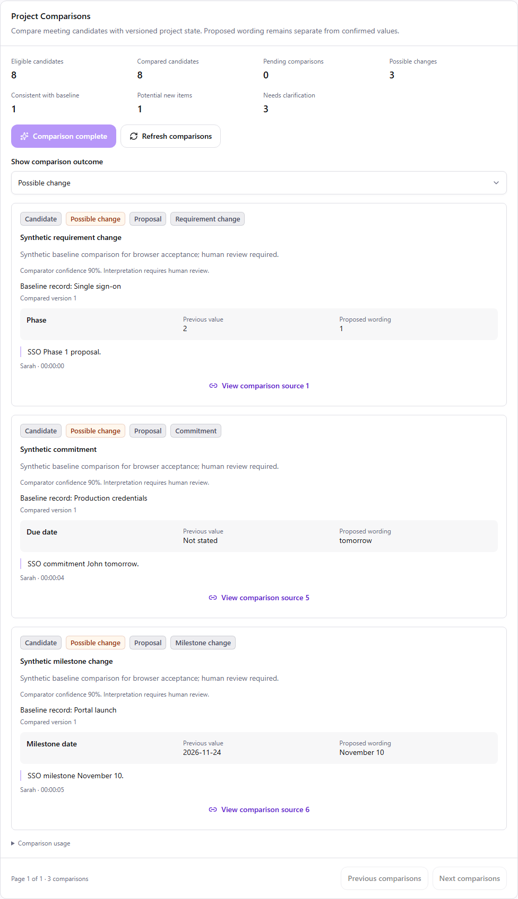
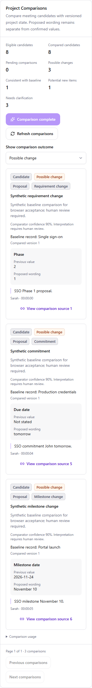

# Phase 6: project delta comparison

Authorized 6 October 2026 (Asia/Calcutta) by the user's request to implement next.
Branch `phase/6-project-delta-comparison`, based on completed main `d44421b`.

## Steps and acceptance

1. **6.1 Contracts/provider:** bounded candidate-to-canonical comparison, validated
   target kinds, literal proposed wording, explicit SAME/CHANGE/NEW/UNCLEAR outcomes,
   Gemini transport, malformed-output and ambiguity tests. No persistence yet.
2. **6.2 Persistence/API:** additive migration, scoped comparison runs and deltas,
   server-owned baseline versions/previous values, cache, pending coverage, stale
   baseline/input handling, leases and audit rollback; no canonical writes.
3. **6.3 UI/acceptance:** meeting comparison panel, explicit batches/retry, previous
   values alongside proposed wording, citations, filters, honest coverage and usage.
   Full regression/build/static/E2E checks, documentation, push and completed PR merge.

Each tested and documented step is committed and pushed before starting the next.
Stop after the Phase 6 merge. Governance, decision-conflict detection and human
approval/application are later phases. The earlier Phase 4/5 live Gemini quality
gap remains open; successful injected-provider tests do not close it.

## Comparison boundary

Compare only current Phase 5 candidates. Current baseline includes active records
and confirmed decisions; provisional/rejected/superseded decisions are not truth.
Selected context is bounded to 100 records/20,000 characters; every versioned target
comes from that scoped selection. One request compares at most 20 candidates and
40,000 candidate characters. Missing/truncated context is explicitly recorded.
NEW is disallowed when selected context is incomplete. Questions, negations and
source/comparator confidence below 0.65 require UNCLEAR. Ambiguous matching must not
invent a target. A possible CHANGE is an interpretation, never an approved conflict.

The provider can return a target ID, explanation and proposed wording. It cannot
provide trusted previous values, versions, owner IDs, actor authority or approval.
The server validates candidate coverage, same-kind supplied targets, unique allowed
fields and verbatim evidence support. Relative/yearless dates remain wording.
The previous value is copied from the selected baseline by the server. No canonical
write service is available to the comparator.

`GEMINI_DELTA_MODEL` independently selects the comparison model (default
`gemini-3.5-flash-lite`); use the existing server-only `GEMINI_API_KEY`. Model and
transport follow [Google's model documentation](https://ai.google.dev/gemini-api/docs/models/gemini-3.5-flash-lite)
and [generateContent API](https://ai.google.dev/api/generate-content). One call per
explicit action, 25-second timeout, 512 KiB response and 8192 output tokens. Missing
access, blocked output or invalid contracts leave work pending; no fake fallback.
Live semantic quality remains unverified until explicitly evaluated.

## Saved comparisons and API

Migration `0008_deltas` follows `0007_events`, adding comparison runs and project
deltas. Composite foreign keys enforce project/meeting/extraction/candidate scope;
source deletion cascades interpretations. Target snapshots intentionally retain
historical ID/kind/version/values even after a later canonical edit or removal.
The target snapshot is not a live foreign-key-backed record or an apply-ready patch.

GET/POST `/api/v1/projects/{projectId}/meetings/{meetingId}/deltas` resolve existing
project membership and meeting scope. POST accepts no body; targets, values, model
and authority cannot be supplied by a browser. GET is read-only, with `page` 1–400,
100 results per page and `outcome=ALL|SAME|CHANGE|NEW|UNCLEAR`.

Each extraction/baseline/model/comparator identity has one comparison run. Each
candidate has one comparison per run, including unchanged/unclear outcomes, so
repeated actions preserve IDs and do not repeat paid calls. An empty extraction
can complete without fabricated deltas or a model call. Further extraction batches
extend eligible candidates. Source pending counts distinguish unfinished relevance
or extraction from comparison completion. Completion applies to eligible candidates.

A 45-second lease prevents concurrent comparison; expired leases are recoverable.
The service releases database locks before calling the provider. It checks the
lease, baseline fingerprint, current extraction and selected candidate/evidence
hash after the call. Changed context/input or supersession discards the whole batch.
Saving all results and finishing audit is atomic. A save/audit failure retains the
started lease until expiry, never a partial result. Missing provider access records
an error without an attempted model call; failures retain saved results and pending
work for explicit retry. Old runs remain readable with a stale warning.

All delta statuses are CANDIDATE. No confirmation, decision-conflict or external
task operation is introduced. Previous values are copied from the selected canonical
record; proposed values remain literal wording (including relative/yearless dates).

## Meeting UI

Open a meeting via Meetings. Project Comparisons sits beneath Project Event Candidates
and above transcript evidence. Explicit relevance/extraction actions refresh its
prerequisites without reloading the page. It shows compared/pending counts, outcome
counts, partial source coverage, bounded-context warnings, historical stale results,
read/write/provider errors, deliberate retry, outcome filters and 100-result pages.

Each result retains candidate/proposal/statement labels, comparator confidence,
the baseline record/version, server-derived previous values, verbatim proposed wording
and original speaker/time/quote citations. Date and owner text are not assignments.
Links open and focus the original utterance, including later transcript pages/reloads.
The proxy accepts only valid scoped UUIDs/filter/page, enforces same-origin writes,
empty POST bodies and bounded timeout. Client validation checks scope, counts,
target kinds/versions, previous-value equality, evidence, source adjacency, literal
changed wording, confidence/intent constraints and incomplete-context NEW rejection.

Browser acceptance uses a test-only comparison provider in `tests/e2e_app.py` with
real API/PostgreSQL persistence. Production `app.main:app` uses Gemini with no synthetic
fallback. See [manual verification](../testing/phase-6-manual-testing.md) for live
acceptance and [results](../testing/phase-6-results.md) for automated evidence.

Screenshots below use synthetic browser acceptance data, not live Gemini results:

