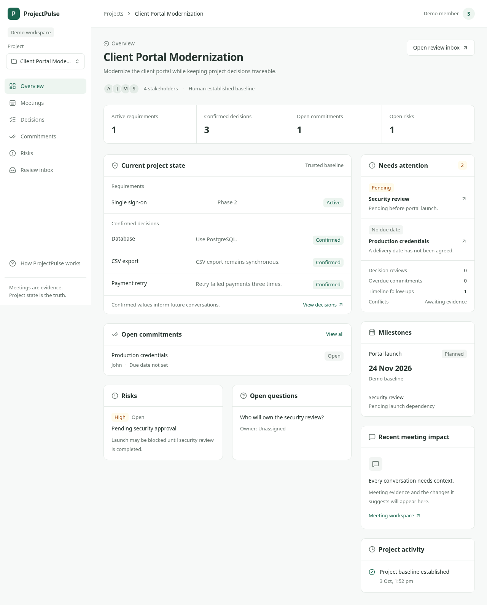

# Project workspace

Status: **Phase 1 complete**. The frontend now provides a read-only project
workspace backed by the Phase 0 schema and seed. Canonical-state and health
behavior remain verified.

## Purpose and user problem

Provide one readable home for the trusted project baseline, unresolved delivery
items and future meeting impact. Users need to see what is established before
comparing a conversation with that state.

## Scope and independently tested steps

1. **1.1 App shell:** sidebar/navigation, project selector, top navigation, accessible
   help dialog, responsive shell, real read-only project list, loading/empty/error/
   unavailable-project states. Navigation is reflected in bookmarkable URLs.
2. **1.2 Overview:** read-only project projection, requirements, confirmed decisions,
   commitments, risks, milestones, questions, stakeholders and project activity.
   Additional navigation views display the corresponding trusted records.
3. **1.3 Needs attention:** explicit review-required decisions, overdue open
   commitments, unresolved due dates and pending/blocked milestone dependencies.
   Conflicts await evidence; no conflict result is invented. Read-only review inbox,
   feature-wide browser verification and desktop/mobile screenshots.

Each step must pass checks, documentation and regression review before the next.
Stop and report at the Phase 1 boundary.

## Acceptance criteria

- Sidebar, project selection and top navigation are usable with mouse and keyboard.
- Selecting a project changes URL/content without mixing another project's data.
- Main states include skeleton/loading, no projects, failed request/retry, unavailable
  project, populated baseline and empty category.
- Desktop has compact readable typography; mobile navigation fits without overflow.
- All six canonical categories are visible; decision truth includes confirmed records.
- Counts and attention items correspond to records, not fabricated model results.
- Meeting impact and review/conflict placeholders do not imply conversations were analyzed.
- The shell, overview and attention flow receives browser testing before completion.

## Non-goals

No canonical-state CRUD, transcript uploads, AI extraction, conflict detection,
review confirmation, or external task writes. Those belong to later phases.
No fabricated processed meetings, evidence links or confidence scores.

## Architecture

FastAPI owns read-only project queries scoped to the server-side local demo actor
(Sarah's stable seed ID). The frontend uses a typed, validated API client and a thin
same-origin transport proxy to FastAPI. The proxy has no data-access or business
logic; backend membership scoping remains authoritative. Presentation components
receive typed records; summary/attention derivation lives outside React components.

Radix UI primitives provide accessible project selection and modal/drawer behavior;
Lucide supplies consistent icons. Styling stays in the existing Tailwind application.

## Data model changes

None. Read the Phase 0 schema and seed. Do not change the deterministic seed
to populate pretend meetings or AI interpretations.

## API changes

- Step 1.1: `GET /api/v1/projects` returns projects assigned to the fixed local demo actor.
- Step 1.2: `GET /api/v1/projects/{project_id}/workspace` returns a scoped read projection.
- Next.js transport routes under `/api/workspace/` forward only those reads with a timeout.

## UI changes

Professional desktop sidebar, project selector, project breadcrumb, view navigation,
responsive drawer and accessible feedback states. Overview displays trusted state
and future meeting areas with honest empty states. Needs attention links to the
underlying records and milestones; the review inbox distinguishes recorded
decision reviews from ordinary delivery follow-ups. It offers no confirmation
actions until evidence-backed review is implemented.

## AI behavior

None. Attention reflects deterministic presentation of persisted baseline records.
Only `REVIEW_REQUIRED` decisions enter the review group. Open/in-progress
commitments are overdue only when their stored due date precedes the snapshot date;
missing dates remain a distinct follow-up. Pending/blocked dependencies count only
when linked to planned/at-risk milestones. Past active milestones are also follow-ups.
Dates use Asia/Kolkata consistently with the demo; due-today work is not overdue.
Source evidence, interpretations and confirmed truth remain separate.

## Edge cases

Empty project list, one project, long project names, unknown project/view query,
slow requests, malformed JSON, backend unavailability, aborted navigation, records
without owner/due date, and category lists with no entries. Do not silently redirect
an unavailable project to another project's state.

## Security considerations

Local prototype only. The server-side demo actor is not production authentication.
Never accept an actor ID from the browser. Backend membership filtering precedes
data serialization. Proxy destinations are server configuration, never user URLs.
Do not expose database credentials or server exception details. Reads do not commit
or mutate canonical state. No public deployment is part of this phase.

## Testing performed

All three steps complete: **57 backend tests** (4 unit/HTTP, 53 real PostgreSQL
integration), **19 frontend domain tests**, and **19 browser tests** pass.
Build, lint, formatting and type checks pass. Coverage includes scoped reads,
confirmed-state counts, source isolation, calendar/date boundaries, keyboard
navigation, filters, retry, empty states, long names and the complete attention flow.
Six affected browser cases were rerun after the mobile header adjustment. The
full suite was rerun after the ProjectPulse rename; the additional backend test
protects installed project/actor IDs. Screenshots show the current product name.
Exact commands and regression review are in
[phase-1-results.md](../testing/phase-1-results.md).

## Screenshots and verified flow

Desktop preview (1280px):

[Mobile preview, 390px](images/workspace-mobile.png).
Both captures were inspected for readable typography, spacing and clipping;
the mobile stakeholder row wraps without breaking words.

Verified flow: select the seeded project → inspect all six canonical categories →
open Production credentials from Needs attention → see John and the unset due date →
return to Overview → open the Security review milestone link → open Review inbox →
see zero decision reviews and two delivery follow-ups. The read-only flow preserves
SSO in Phase 2 and the confirmed baseline. Empty projects, explicit review-required
records and overdue commitments are exercised with controlled fixtures.

## Known limitations

One seeded project and a fixed local demo actor. State editing, transcript evidence
and review actions are not yet available. The demo timezone is fixed to Asia/Kolkata;
attention updates when the workspace snapshot loads, not on a midnight timer.
Public deployment remains future work. Pushed checkpoints run in GitHub Actions.

## Future improvements

Replace local identity with authentication before public access; add manual state
editing in Phase 2 and meeting ingestion in Phase 3. Keep the same UI/API boundaries
as those capabilities arrive.
