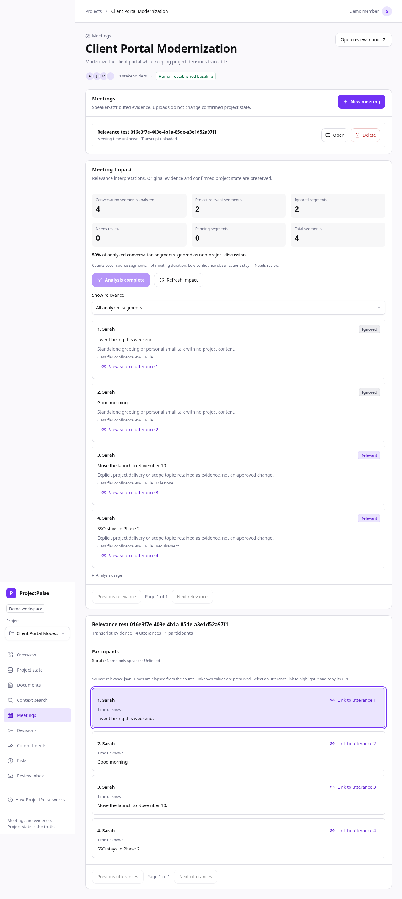

# Project relevance filter

Phase 4 decides which conversation segments deserve project analysis. The result
is an interpretation of meeting evidence, never a confirmed requirement, decision,
owner or date. Original transcripts and canonical state are preserved.

## Step 4.1: classification boundary

A classification has `relevant`, finite numeric `confidence` (0–1), a short `reason`
and `relatedEntityTypes`: requirement, decision, commitment, risk, milestone,
dependency or open_question. Unknown types, extra fields, string/boolean scores,
duplicate IDs/types and partial provider output are rejected. An ignored result
has no related entity types. Confidence is an estimate, not measured accuracy.

Narrow deterministic rules recognize explicit project topics and standalone
personal small talk. Unknown text is retained for contextual/AI analysis. Mixed
social/project segments are not discarded just because they mention a weekend.
The initial rule benchmark deliberately records three keyword false positives
(hobby PostgreSQL, movie launch date, another client's deployment); contextual
rules in Step 4.2 must improve these before phase acceptance.

`RelevanceProvider.classify()` isolates provider details. `GeminiRelevance` uses
one bounded generateContent call for a batch, the existing server-only
`GEMINI_API_KEY`, and optional `GEMINI_RELEVANCE_MODEL` (default
`gemini-2.5-flash`). It uses a fixed Google destination, 25-second timeout,
20,000-character segment budget, at most 40 segments and a 512-KiB response bound.
JSON-schema output is independently validated against the exact requested IDs.
Blocked/truncated/malformed responses fail safely; there is no fake classification
when configuration or provider access is missing. There is no automatic retry.

The model name is configurable because availability can vary by account. Embeddings
continue to use gemini-embedding-001 independently. No new key or browser-visible
secret is required. Transcript and selected context are sent as untrusted data;
provider instructions prohibit following commands inside source content.

## Benchmark and limitations

[relevance-benchmark.json](../examples/relevance-benchmark.json) contains 50
explicitly labeled synthetic utterances, balanced 25 relevant/25 irrelevant, with
expected labels and label reasons. Source order/previous utterance can matter.
The benchmark is a regression aid, not an independently validated production
accuracy claim. Rule coverage and false positives/negatives are reported separately
from unresolved items and provider-contract tests. Contract tests use synthetic
responses and do not establish live Gemini quality.

Context-aware persistence/API and meeting UI are implemented in individually tested
Step 4.2 and Step 4.3 checkpoints. Phase 5 event extraction is outside this feature.

## Step 4.2: current project context and durable analysis

The classifier receives selected ACTIVE requirements, CONFIRMED decisions, open
commitments/risks/questions, active milestones and dependencies from the current
accessible project. Owners come from explicit project membership. Context is bounded
to 60 facts / 12,000 serialized fact characters and 100 member names; truncation is
reported. Closed obligations and provisional decisions are not treated as baseline.

Availability such as “Raj is off Friday” is relevant when selected context includes
Raj's explicitly owned Friday deployment. Without an active owned obligation and
with complete context, it is ignored. Unknown dates, ambiguous names or incomplete
context stay unresolved. No owner, date or criticality field is invented. Mixed
project/personal statements are retained; standalone hobby/film/other-client examples
are filtered conservatively.

`0006_relevance` adds relevance_analyses and utterance_relevance, plus a scoped
utterance uniqueness constraint. Composite foreign keys protect project/meeting
attribution; indexed queries support scoped retrieval, filtering and pagination.
Deleting a meeting cascades interpretations while preserving audit events. There
is no canonical-table write in relevance processing.

GET/POST `/api/v1/projects/{project}/meetings/{meeting}/relevance` reads/runs analysis.
GET supports page 1–100 and outcome ALL/RELEVANT/IGNORED/UNCERTAIN, 100 rows/page.
POST first applies rules to every source utterance, then processes at most 40
unresolved segments / 20,000 segment-and-neighbor characters in ONE provider call.
Another explicit POST continues the next batch. There is no sampling or background
loop. Long transcripts show remaining coverage, not an invented full-meeting result.

Confidence below 0.65 is UNCERTAIN; these classifications count as analyzed but
never ignored/relevant. An unavailable/failed/invalid provider batch remains pending;
no fake result is saved. Metrics use exact stored segments. The ignored percentage
uses the analyzed denominator, with unprocessed/uncertain counts shown separately.
This is a segment share, not a duration or mathematically calibrated intelligence.

Canonical values/versions, membership, source hash, model and classifier version
form the cache identity. Unchanged completed analyses reuse results without another
provider call or success audit. A baseline edit marks previous interpretations stale;
explicit analysis creates a fresh snapshot. Context changes during an AI call cause
its output to be discarded. Historical runs are retained until meeting deletion.

Network requests hold no DB locks. A 45-second server lease rejects concurrent
analysis with 409 and permits explicit recovery after expiry. Source deletion or a
newer attempt cannot resurrect results. Rule checkpoints and model batches have
separate atomic audits; a final persistence/audit failure rolls back model results
and releases the lease, preserving the audited rule checkpoint.

Provider attempt count, cumulative latency and provider-reported input/output tokens
are stored. Missing usage is not guessed: usageReportedCalls states how many calls
reported both counts. A failed attempt can consume provider quota; retry is explicit.

### Reproduce the benchmark

From apps/api:

```sh
uv run python -m app.check_relevance
uv run python -m app.check_relevance --live
```

The default uses a synthetic selected-project fixture with Raj's Friday obligation,
resolving 35/50 labels with zero false positives/negatives among resolved examples;
15 remain unresolved. `--live` explicitly sends unresolved examples to your
server-configured Gemini and reports false positives, false negatives, uncertain
and unresolved IDs. It does not access/change your database. A nonzero code records
label mismatches or provider failure; do not report a full live pass from rule-only
or synthetic contract output.

## Step 4.3: Meeting Impact and evidence navigation

Open **Meetings**, choose a meeting with an uploaded transcript and click
**Analyze relevance** in **Meeting Impact**. The purple panel displays analyzed,
project-relevant, ignored, Needs review, pending and total segment counts. The
percentage is ignored / analyzed, rounded to a whole percentage; pending coverage
is called out explicitly. A 12.5% share displays as 13% consistently in API and UI.

Analysis is explicit. **Analyze next batch** continues bounded processing;
**Retry remaining segments** retries unresolved evidence after a provider failure.
**Refresh impact** only reads saved results. Reloading or filtering never calls
Gemini. Completed current analyses disable their action; stale analyses offer
**Analyze current baseline**. Missing transcripts show an upload prerequisite.

**Show relevance** filters saved classifications, 100 per page. Each includes a
source quote, reason, confidence estimate, rule/AI method and related entity types.
**View source utterance** links to the unchanged, full original text with its
speaker and timestamp. The stable citation stays focused and visible after reload,
including when impact data loads later. Client validation checks project/meeting
IDs, source IDs/sequence/speaker/quote and coverage consistency before display.
Impact loading/failure does not prevent reading the original transcript.

**Analysis usage** reports actual attempted requests, recorded provider latency and
reported tokens. Unknown usage is labeled. The UI has keyboard-operable controls,
wrapping source text and tested desktop/375-pixel mobile layouts.



[Mobile preview](images/relevance-mobile.png).

## Acceptance and practical limits

Use the [Phase 4 manual testing scenarios](../testing/phase-4-manual-testing.md)
for deterministic counts, live Gemini, citations, stale context and retry checks.
The [results report](../testing/phase-4-results.md) distinguishes real API/database
and browser checks from synthetic provider output. Canonical records and original
transcripts remain unchanged by analysis; this phase creates no proposed events,
owner/date changes or review decisions.

Rules are deliberately narrow. The 50-example expected-label set should be reviewed
against your own project language before treating model performance as adequate.
Short replies, implied relationships, multilingual text and omitted/truncated
context can remain pending or receive incorrect model interpretations. A score
of 0.65 is a routing threshold, not an accuracy guarantee. The application is still
a local prototype with a fixed demo identity; production authentication is future
work. Large meetings require explicit batches; no meeting bot, audio transcription
or background processing is introduced.

Google's [model lifecycle documentation](https://ai.google.dev/gemini-api/docs/deprecations),
checked 5 October 2026 (page updated 1 October 2026), lists no announced shutdown
date for `gemini-2.5-flash`. It remains the configurable default generation model;
`gemini-embedding-001` continues serving document retrieval independently. This
documentation check does not establish live account access or classification quality.
