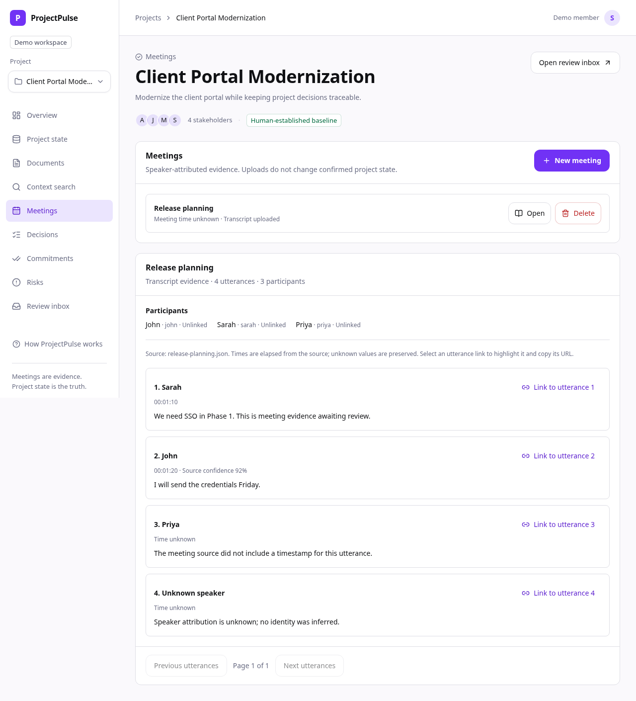
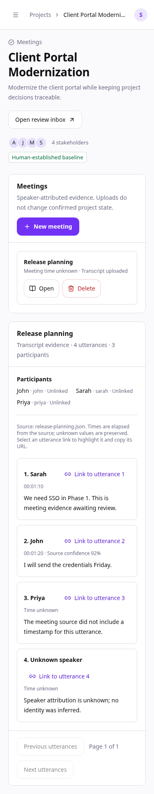

# Meetings and speaker-attributed transcript ingestion

Status: Phase 3 in progress on `phase/3-meeting-transcript-ingestion`.

Meetings are evidence, not confirmed baseline changes. A meeting belongs to one
project, has a title and optional timezone-aware start time, and records its human
creator. Participants have stable meeting-local IDs, distinct speaker keys and
optional explicit links to existing project members. Repeated display names are
allowed; membership is never inferred from a name.

Utterances retain a stable UUID, meeting ID, zero-based source sequence, speaker
label snapshot, optional participant ID, optional elapsed milliseconds, optional
end time, original text and optional confidence. Missing time/speaker identity stays
unknown. Project/meeting composite foreign keys enforce isolation in PostgreSQL.
Meeting deletion cascades evidence and participants, while retaining its audit.

## Checkpoints

1. Meeting/participant/utterance schema and scoped audited API; additive migration.
2. Deterministic, bounded structured text/JSON/VTT upload and source provenance.
3. Meeting management, participants, upload and source-linked browser viewer.
4. File adapter contract with future provider boundaries, without external bots.
5. Phase-wide regression/E2E acceptance and completed-phase merge.

Live streaming is optional in the brief and deferred. No AI interpretation,
canonical mutation, meeting bot, external conferencing adapter or audio transcription
is included. The existing fixed local demo actor remains a prototype limitation.

## API implemented in Step 3.1

`/api/v1/projects/{projectId}/meetings` supports list (latest 200) and create.
`/{meetingId}` supports scoped detail and confirmed client-side deletion.
`/{meetingId}/participants` adds a named speaker key and optional project member ID.
Participants are capped at 100 and immutable once a transcript is uploaded.
Writes attribute audit events to the server-owned actor in the same transaction.

Migration `0005_meetings` adds three tables and indexes; preserve your `.env`,
canonical data and database volume. Run `uv run alembic upgrade head` from `apps/api`.
Downgrade checks run only on the guarded disposable test database.

## Step 3.2 — file ingestion

POST `/{meetingId}/transcript?filename=...` sends raw file bytes, not multipart.
Supported UTF-8 formats are `.txt`, `.json` and `.vtt` (UTF-8 BOM is accepted).

Structured text uses one utterance per nonempty line:

```text
00:01:10 | Sarah | We need SSO in Phase 1.
00:01:20 | John | I'll send credentials Friday.
 | Sarah | Timestamp was not provided.
 | | Speaker and time are unknown.
```

Text after the second pipe is preserved, including further pipes. JSON accepts an
array or `{ "utterances": [...] }`. Each row supports `speaker`, `speakerId`,
`timestamp`, `endTimestamp`, `text` and `confidence`; only `text` is required.
Times are elapsed `HH:MM:SS` or `HH:MM:SS.mmm`, not invented wall-clock dates.
Confidence is optional and must be finite in [0, 1]; no confidence is inferred.

```json
{"utterances": [
  {"speaker": "Sarah", "speakerId": "sarah-1", "timestamp": "00:01:10", "text": "Need SSO."},
  {"speaker": "Sarah", "speakerId": "sarah-2", "text": "I am a different Sarah."}
]}
```

JSON IDs use participant keys `id:<speakerId>`. Name-only TXT/VTT/JSON rows use
`name:<speaker>`, without matching project members by name. Explicit registration
may map that key to a member before upload. Source labels remain unchanged even
when a participant's display name differs. Blank TXT speaker / absent JSON speaker
with no ID remains null identity and displays Unknown speaker. The same JSON ID
with conflicting names is rejected; repeated names with different IDs stay distinct.
Name-only formats cannot distinguish two people sharing an identical label.

VTT supports cue identifiers, elapsed start/end time, cue settings, multiline text,
`<v Speaker>` labels and escaped text. It skips NOTE/STYLE/REGION metadata and removes
presentation tags; multiple voices in a single cue are rejected. It does not execute
markup or fetch external content. Source order wins over timestamp order.

Limits: 2 MiB raw bytes, 10,000 utterances, 6,000 characters per utterance, 1,000,000
text characters total, 100 registered/transcript speakers and elapsed time within
seven days. Stream limits precede body accumulation. Invalid input returns a safe
message/position without reflecting private text and writes nothing.

One immutable transcript belongs to each meeting. Original bytes, filename, format
and SHA-256 are stored with utterances atomically under a meeting row lock. Exact
re-upload returns the same IDs without another audit; a different source returns
409, preserving existing citations. Create another meeting for a different source.
Deletion removes all meeting evidence; uploads never modify canonical state or
send transcript content to Gemini.

## Step 3.3 — browser workflow

Open **Meetings**, choose **New meeting**, enter its title and optionally a local
start time. The browser records that time with its timezone; blank stays unknown.
Before upload, **Add participant** can register an exact source label or JSON speaker
ID and explicitly link it to a project member. Upload also creates unlinked source
speakers automatically. Member matching is never inferred.

Open a meeting, choose one TXT/JSON/VTT file, and explicitly **Upload transcript**.
Format examples are available in the upload form. Failures retain the selected file
and draft; fix/change the source and retry. Success persists through reload. A
meeting's source is immutable; create a new meeting for a different transcript.

The viewer separates participants from speaker-attributed utterances. It shows source
filename, sequence, elapsed time/end time, readable text and supplied confidence;
unknown time/speaker is labeled. **Link to utterance** creates a bookmarkable URL
with project, meeting and stable utterance IDs. Opening that link selects the proper
100-row page, scrolls to and focuses/highlights the utterance. A missing citation
is explicit. Previous/next controls keep long transcripts usable.

Lists/detail have loading, empty, error and retry states. Client schemas reject
outside-project/meeting IDs, unknown participant references, duplicate IDs,
out-of-order sequence and oversized evidence. Same-origin server proxies validate
UUID paths and stream body limits before contacting FastAPI. React escapes source
text rather than rendering uploaded HTML. Confirmed deletion removes evidence and
participants with truthful audit retention. Dialogs trap/restore focus, preserve
failed drafts and protect pending writes. Long labels wrap at 375px.



